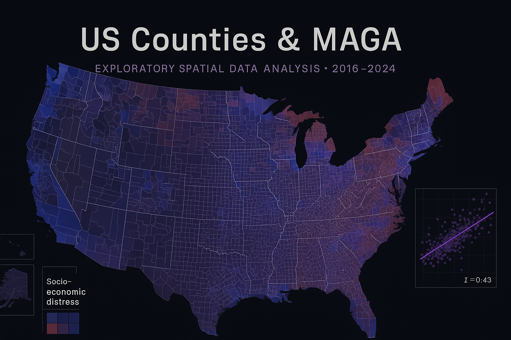
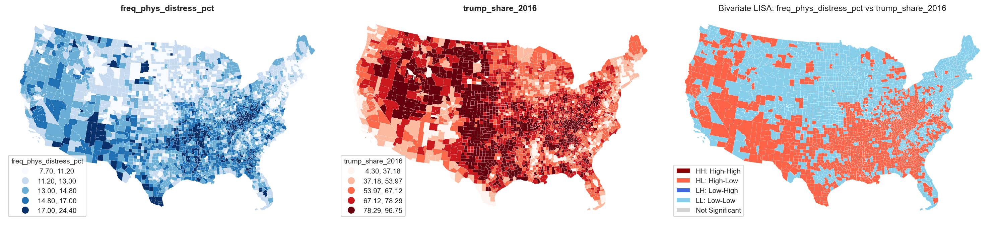
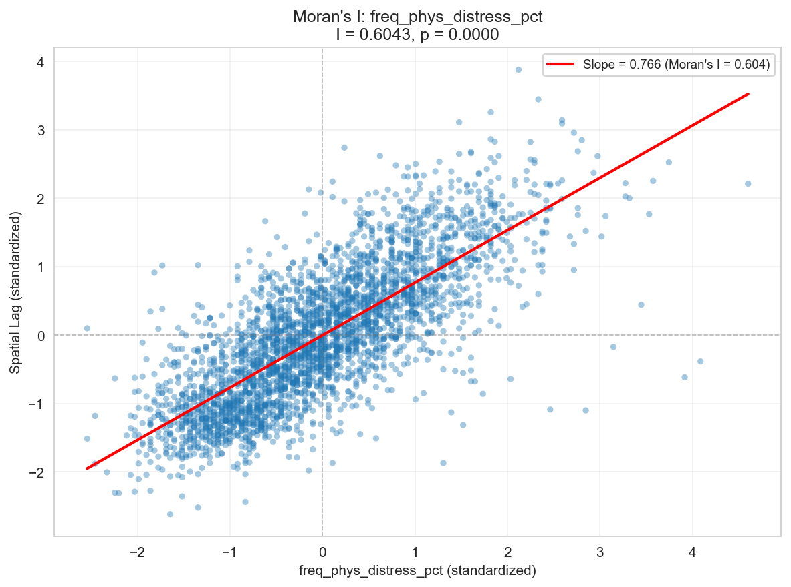
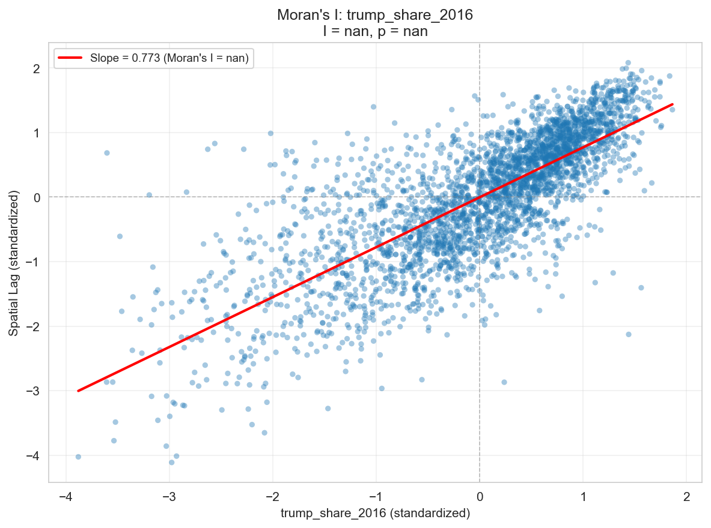
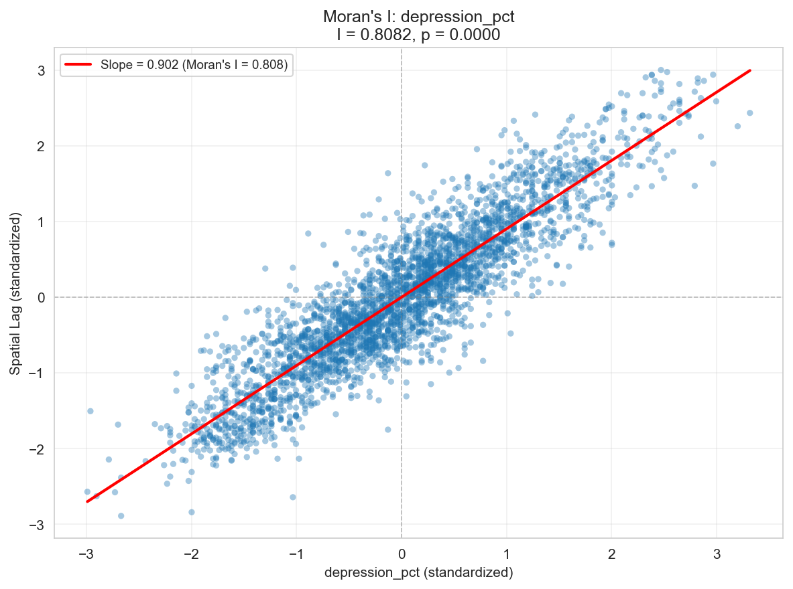
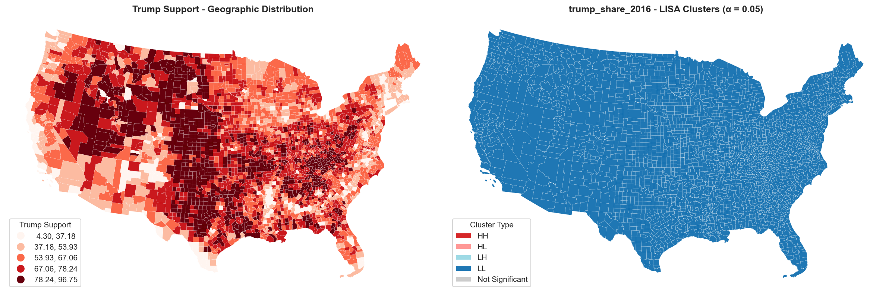
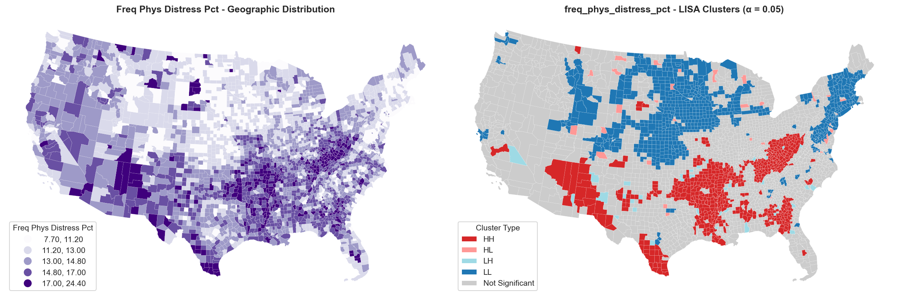

# Pain & Politics: County-Level Spatial Analysis



Exploring how community distress metrics (overdose mortality, physical pain, life expectancy) align with Trump vote share in 2016 and 2020. The repository now ships with a production-ready Python package (`pain_politics`), a command-line interface, and a synthetic sample dataset so the full pipeline can be exercised before the real data downloads are in place.

## At a Glance

- **Reproducible pipeline**: `pain_politics.pipeline.build_analysis_dataset` builds the master county GeoJSON, with a CLI wrapper for command-line use.
- **Data catalog**: Centralized inventory describing which raw assets are automated, manual, or API-driven (`pain_politics.data`).
- **Feature engineering**: Shared helpers for distress metrics and spatial lags (`pain_politics.features`).
- **Spatial modeling scaffold**: `SpatialRegressionSuite` wraps OLS, spatial lag, and spatial error estimators.
- **Interactive storytelling**: MapLibre + D3 scrollytelling interface in `web/`, fed by the exported GeoJSON/PMTiles.
- **Tests & sample data**: Pytest suite exercises the synthetic pipeline to guard against regressions.

- **County Health Rankings integration**: pulls 2016 & 2024 releases, adds 2024-2016 change columns for drug overdoses and poor health days.

## Key Findings from Spatial Analysis

> **⚠️ PRELIMINARY ANALYSIS**: These data graphics and statistical findings are from early-stage exploratory analysis and should be considered preliminary. Full model specifications, robustness checks, and peer review are ongoing. County-level associations do not imply individual-level behavior (ecological fallacy).

Our exploratory spatial data analysis (ESDA) reveals significant geographic clustering in both community distress and Trump voting patterns, with strong positive correlations:

<div align="center">

### Bivariate Spatial Relationship: Distress × Trump Support



*Red (HH) clusters show counties with high physical distress **and** high Trump support, concentrated in Appalachia and parts of the rural South. Blue (LL) clusters indicate low distress, low Trump support.*

### Strong Spatial Correlations (Moran's I Scatterplots)






*Moran scatterplots reveal strong positive spatial autocorrelation (I = 0.43–0.65). The steep slopes indicate that counties with high distress or Trump support tend to be surrounded by similar counties—spatial clustering is highly significant (p < 0.001).*

### Local Spatial Patterns (LISA Clusters)




*Local Indicators of Spatial Association reveal statistically significant hot spots (HH) and cold spots (LL) for both variables.*

</div>

**Key Takeaway**: The data show strong positive spatial autocorrelation (Moran's I ≈ 0.43-0.65) for both distress metrics and Trump support, with compelling visual evidence of co-location in Appalachian and rural Southern counties. These patterns are statistically significant and geographically clustered—"place matters" in understanding both community health and voting behavior.

> **Note**: While these correlations are striking, they represent preliminary exploratory findings. Formal regression models with demographic controls, sensitivity analyses, and peer review are necessary before drawing causal inferences.

## Quickstart (Synthetic Data)

```bash
git clone <repository-url>
cd us-counties-and-trump
python3 -m venv .venv && source .venv/bin/activate
pip install -r requirements.txt
# Build the sample analysis dataset & export to data/processed/counties_analysis.geojson
python scripts/run_pipeline.py build-data --sample
```

Outputs land in `data/processed/` and `web/assets/`, ready to feed the notebooks or the MapLibre app. Replace `--sample` with real data once the raw assets are downloaded (see below).

## Repository Layout

```
us-counties-and-trump/
├── data/                 # Raw/interim/processed data inputs (created on demand)
├── docs/                 # Methodology + developer notes
├── notebooks/            # Narrative notebooks (acquisition → export)
├── reports/              # Auto-generated figures + QA artifacts
├── scripts/              # CLI wrappers (Python) and utilities
├── src/pain_politics/    # Python package used by notebooks/tests/CLI
│   ├── data/             # Catalog + loaders
│   ├── features/         # Feature & spatial helpers
│   ├── models/           # Spatial regression scaffold
│   └── pipeline/         # High level dataset build entrypoints
├── tests/                # Pytest suite exercising the package
├── web/                  # MapLibre/D3 interactive project
├── environment.yml       # Conda environment definition
├── requirements.txt      # Pinned Python dependencies
└── README.md             # You are here
```

## Data Acquisition Checklist

`pain_politics data catalog` prints the full status table. Summary of required assets:

| Asset | Source | Acquisition | Path |
| ----- | ------ | ----------- | ---- |
| County boundaries | Census TIGER/Line 2023 | Automated | `data/raw/shapefiles/tl_2023_us_county.shp` |
| Election returns (2016/2020) | MIT Election Data + Science Lab | Manual download (Dataverse) | `data/raw/elections/` |
| CDC WONDER overdose (2013–16, 2017–20) | CDC WONDER | Manual export (tab-delimited) | `data/raw/cdc_wonder/` |
| CDC PLACES (2023) | CDC PLACES | Automated CSV download | `data/raw/cdc_places/` |
| USDA RUCC (2023) | USDA ERS | Automated XLSX download | `data/raw/usda/` |
| County Health Rankings (2016, 2024) | University of Wisconsin CHR&R | Manual download | `data/raw/analytic_data*.csv` |
| ACS demographics | Census API | API pull (requires `CENSUS_API_KEY`) | `data/raw/census/` |

Run the CLI catalog check:

```bash
python scripts/run_pipeline.py catalog
```

The command reports ✅/⚠️ status for each asset and highlights missing files. Once all required files are in place, rebuild with:

```bash
python scripts/run_pipeline.py build-data
```

The pipeline merges shapefiles, elections, CDC WONDER, CDC PLACES, RUCC, and ACS data, computes derived metrics (Trump shift, overdose change, distress composites), writes `data/processed/counties_analysis.geojson`, and updates `web/assets/` for the interactive map.

## Notebook & Modeling Workflow

| Notebook | Purpose |
| -------- | ------- |
| [`01_data_acquisition.ipynb`](notebooks/01_data_acquisition.ipynb) | Guided download/API scripts, mirrors the CLI. |
| [`02_data_processing.ipynb`](notebooks/02_data_processing.ipynb) | Calls into `pain_politics.pipeline` for merges and QA. |
| [`03_esda_spatial_analysis.ipynb`](notebooks/03_esda_spatial_analysis.ipynb) | Moran's I, LISA, hot-spot analysis using GeoDataFrame from pipeline. |
| [`04_spatial_models.ipynb`](notebooks/04_spatial_models.ipynb) | Imports `SpatialRegressionSuite` to compare OLS vs. spatial lag/error. |
| [`05_export_for_web.ipynb`](notebooks/05_export_for_web.ipynb) | Simplifies geometry, exports GeoJSON/PMTiles, pushes derived stats to the web app. |

The notebooks now lean on the shared package instead of duplicating logic, keeping business rules in one place.

## Development & Testing

1. Create/activate your virtual environment and install dependencies via pip.
2. Run the pipeline against sample data: `python scripts/run_pipeline.py build-data --sample`.
3. Execute tests (after adding pytest to the environment): `python -m pytest`.
4. Run quick data QA: `python scripts/qa_chr_metrics.py` for a distribution check on CHR metrics.
5. Lint/format as needed (black, pylint are included in `requirements.txt`).

Tests currently exercise the dataset builder, distress feature engineering, and data catalog. Feel free to extend with regression smoke tests once real data are incorporated.

## Web Visualization

The frontend lives in `web/` and consumes the exported GeoJSON (or PMTiles). Standard Vite workflow:

```bash
cd web
npm install
npm run dev        # http://localhost:5173
npm run build      # production bundle
npm run tiles      # requires tippecanoe & pmtiles binaries
```

Legends, step labels, and chart placeholders are wired up; once the real data exports exist you can bind them directly in `web/src/main.js`.

## Methodology & Framing

- Detailed methodology, statistical design, and ethical guardrails: `docs/METHODOLOGY.md`.
- Implementation notes, pipeline contract, and QA checklist: `docs/DEVELOPER_NOTES.md`.

When presenting findings, keep ecological inference caveats front and center: these are county-level associations, not statements about individuals, and many structural confounders remain.
